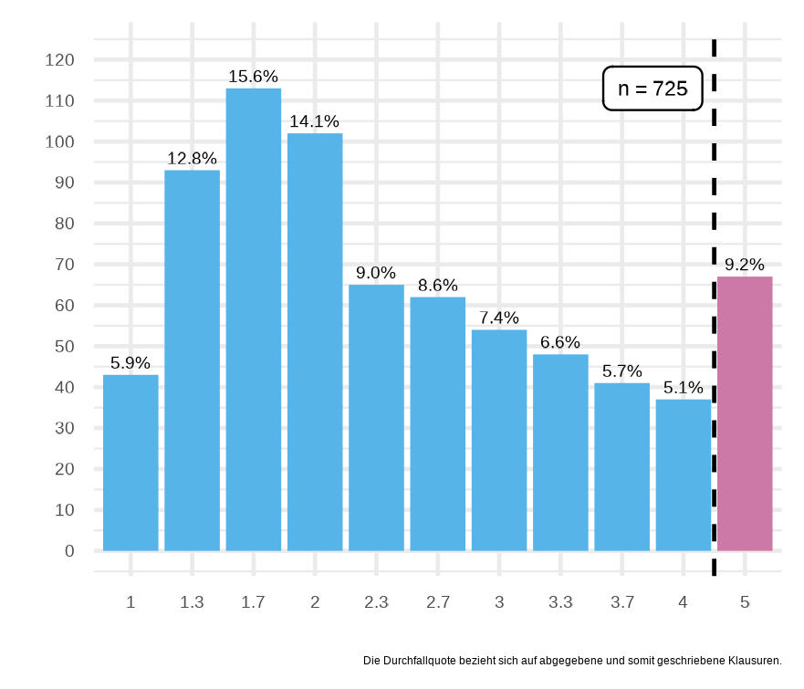
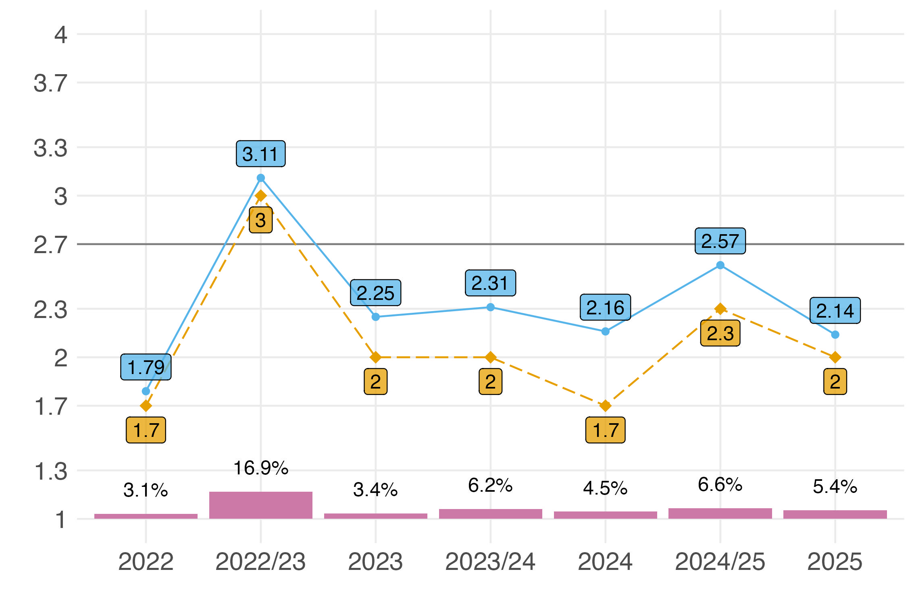

*Wenn du auf dem Handy schaust, dann klicke oben auf 'View code' um dir die Ordner mit den Klausuren anzeigen zu lassen.*

# Das Archiv

>*“There is no such thing as a new idea. It is impossible. We simply take a lot of old ideas and put them into a sort of mental kaleidoscope. We give them a turn and they make new and curious combinations. We keep on turning and making new combinations indefinitely; but they are the same old pieces of colored glass that have been in use through all the ages." - Mark Twain*

Hier findest du alle Klausuren nach Jahr und Semester aufgeteilt über alle Studiengänge. Da es pro Klausur immer mal mehrere Versionen geben kann, gibt es natürlich auch mehrere Dateien für eine Klausur. Dazu kommen dann noch die Probeklausren, wenn ich dran denke die Probeklausuren hochzuladen. Dadurch das es sich hier um ein Archiv handelt sind natürlich die Klausurfragen in der Form nicht mehr aktuell.

## Notenspiegel über alle Veranstaltungen

## Notenspiegel über alle Veranstaltungen und Jahre

